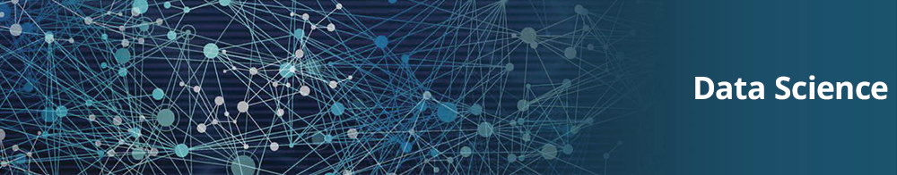

  

# Leonardo Chagas
*Business Analytics | Data Analytics* at Itecnove

As a experienced Data Scientist and Air Force pilot I combine analytical skills, ability to work in team environments, and attention to details. Having spend the last years applying Machine Learning to Brazilian Air Force real problems, I developed a critical thinking and problem-solving skills.

**Background in:** Python, Machine Learning, Space Operations and Mathematical Optimisation.

**Links:**
* [LinkedIn](https://www.linkedin.com/in/leonardo-chagas/)
* [Medium](https://medium.com/@leonarddocchagas)

## Projetos:
Veja os tutoriais publicados :

* **Data Science: Investigando o naufrágio do Titanic:** https://bit.ly/2Ubr5SH
* **Como Tratar Dados Ausentes com Pandas:** https://bit.ly/31KWSMN
* **XGBoost: aprenda este algoritmo de Machine Learning em Python:** https://bit.ly/2UbRhws
* **Como criar uma Wordcloud em Python:** https://bit.ly/2OxsphM
* **Como lidar com dados desbalanceados:** https://bit.ly/2ZlaNsV

---

### Sobre mim:

Sou analista de dados desde 2013 na itecnove e meu dia-a-dia é repleto de atividades como coletar, tranformar e analisar dados nos mais variados tipos de negócios.

* Graduação em Sistemas para Internet.
* Curso de Operações Espaciais pela Força Aérea do Canadá.

